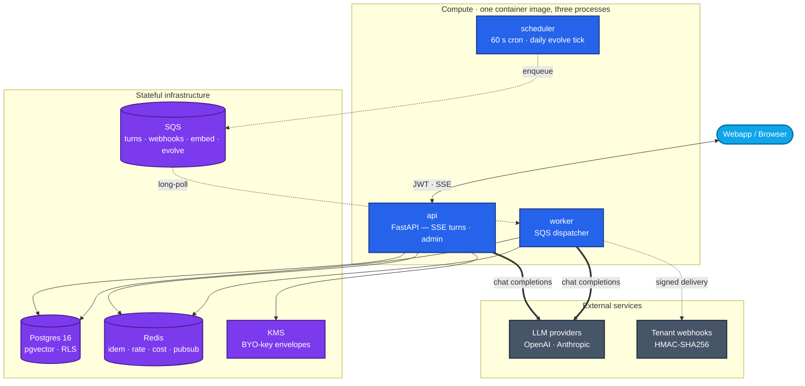

<div align="center">

# lite-horse

**Multi-tenant cloud assistant runtime — persistent memory, per-agent personas,
pgvector recall, layered conditional skills, KMS-encrypted BYO provider keys,
and an offline self-evolution loop.**

Built on the [OpenAI Agents SDK](https://github.com/openai/openai-agents-python).

[](https://www.python.org/)
[](https://github.com/openai/openai-agents-python)
[](https://fastapi.tiangolo.com/)
[](https://github.com/pgvector/pgvector)
[](https://docs.astral.sh/ruff/)
[](https://mypy-lang.org/)

</div>

---

## What it is

A horizontally-scalable FastAPI service that gives any webapp a personal-assistant
agent per end-user, with the state, tools, and self-evolution loop usually only
seen in long-lived single-tenant agents — but kept tenant-safe by Postgres RLS,
KMS encryption contexts, and Redis key namespacing pivoting on the same
`user_id` (and now per-agent `agent_id`) boundary.

The cloud HTTP API is the only deployed product surface. A standalone
`litehorse` CLI runs the same agent loop locally against `~/.litehorse/`
for skill / memory iteration.

> **Status:** v0.5 shipped (2026-05-14). Tenant-safe tool backends
> (Phase 40), per-agent personas (41), pgvector recall (42), session
> summaries + cross-session compaction (43), curator + outcome
> classifier (44), user-skill promotion + GEPA-style offline evolve
> (45), and operational hardening — GDPR delete pipeline, audit-log
> shipper, SDK bumps, security headers, CLI parity hard gate (46) —
> all green. See [docs/PROGRESS.md](docs/PROGRESS.md) for the full
> ledger.

## Architecture



<sub>**Legend** — sky: client · blue: compute · violet: stateful infra · slate: external. **`==>`** primary turn path (LLM round-trip) · **`-->`** synchronous service call · **`-.->`** async / queue / signed-webhook hop.</sub>

Three processes share one container image: **api** (FastAPI + SSE),
**scheduler** (APScheduler — cron + daily evolve enqueue), **worker**
(SQS long-poll: turns, signed webhooks, embedding backfill, evolve
proposals).

## Surfaces

| Surface | Use when | Reference |
|---|---|---|
| **HTTP API** (FastAPI on AWS ECS) | Product surface for any webapp — JWT-authenticated, per-tenant | [docs/HTTP-API.md](docs/HTTP-API.md) · live `GET /openapi.json` |
| **`litehorse` CLI** | Local dev against `~/.litehorse/` — iterate on skills/memory before pushing | [docs/CLI.md](docs/CLI.md) |
| **`lite_horse.api` Python** | Legacy embedded path; kept for the dev REPL only | [docs/EMBEDDING.md](docs/EMBEDDING.md) (deprecated) |

## Highlights

- **Multi-tenant by construction.** Every Postgres row carries `user_id` (and,
  on user-scope tables, `agent_id`); RLS policies key off
  `current_setting('app.user_id')` + `app.agent_id` GUCs set in every
  transaction. Redis keys, KMS encryption contexts, and the MCP connection
  pool all pivot on the same boundary. `tests/security/test_rls_leak.py`
  proves cross-tenant `SELECT` returns `[]` under a non-superuser app role.
- **Per-agent personas.** Each user can run multiple named agents
  (`/v1/users/me/agents`); persona, default model, permission mode, enabled
  tools, rate limit, and cost budget are per-agent. Memory, skills, cron,
  and sessions are scoped on `(user_id, agent_id)`.
- **Persistent memory + pgvector recall.** `MEMORY.md` + `USER.md` per
  (user × agent) with compression-as-consolidation and a periodic nudge.
  `memory_chunks` is HNSW-indexed (`vector(1536)`) with a tsvector-`+`-cosine
  hybrid search exposed as the `memory_search` tool.
- **Layered config.** `bundled` → `official` → `user` precedence for skills,
  instructions, slash commands, MCP servers, and cron jobs. Admins push
  official content with mandatory / opt-out semantics; cache invalidation
  fans out via Redis pub/sub `effective-config-invalidate`.
- **Conditional skills.** Markdown procedures the agent loads only when
  their triggers match. The offline evolve worker proposes revisions from
  recorded failures — proposals require human approval, never auto-merge.
- **Streaming HTTP turns.** SSE endpoint with `Idempotency-Key` 24 h replay
  (raw bytes), ask-mode permission round-trip via `PermissionBroker`
  (in-process futures + Redis pub/sub fallback), per-session distributed
  lock, and abort.
- **Multi-provider + cost meter.** `ModelProvider` Protocol covers
  OpenAI and Anthropic (via Anthropic's OpenAI-compatible endpoint).
  Per-turn `usage_events` rows in micro-USD (no float drift); per-user
  daily cost budget enforced in Redis with 80 % alert / 100 % block.
- **Per-tenant rate limit.** Redis fixed-window counter on
  `POST /v1/turns*` (60/min default; per-user / per-agent override).
- **KMS-encrypted BYO keys.** OpenAI / Anthropic / GitHub credentials sealed
  under `EncryptionContext={"user_id": ...}`; one narrow accessor in the
  whole codebase reads plaintext.
- **Scheduler + worker split.** APScheduler ticks every 60 s (cron + daily
  evolve enqueue). Standalone SQS worker runs turns, signs HMAC-SHA256
  webhook deliveries, backfills embeddings, and produces evolve proposals.
- **Observability.** structlog JSON logs with `request_id` / `user_id` /
  `agent_id` / `session_key` / `turn_id` bound on contextvars, OTel
  traces (OTLP/HTTP), EMF JSON-line metrics; CloudWatch dashboard +
  alarms shipped via AWS CDK.

## Quickstart

### Cloud HTTP API

```bash
uv sync --extra dev
cp .env.example .env                 # fill DB / Redis / JWKS / provider keys
make dev                             # postgres + redis + minio + api + scheduler + worker
make migrate                         # alembic upgrade head
```

```bash
curl -sS -X POST http://localhost:8080/v1/turns \
    -H "Authorization: Bearer $JWT" \
    -H "Content-Type: application/json" \
    -H "Idempotency-Key: $(uuidgen)" \
    -d '{"session_key":"demo","text":"hello"}'
```

Surface contract (auth, rate limits, idempotency, errors):
[docs/HTTP-API.md](docs/HTTP-API.md). Live OpenAPI at `GET /openapi.json`.

### CLI (developer use only)

```bash
litehorse                            # interactive REPL against ~/.litehorse/
litehorse "write a haiku"            # one-shot; stream, then exit
litehorse --session <key>            # resume an existing session
echo "hi" | litehorse                # one-shot from piped stdin
```

The CLI shares no state with the cloud service. It exists for local
iteration on skills, memory, and the agent loop.

## Tools

Always available to every agent:

| Tool | Purpose |
|---|---|
| `memory` | Read / write `MEMORY.md` and `USER.md` for the current `(user_id, agent_id)` |
| `memory_search` | Hybrid pgvector + tsvector recall over memory chunks, session summaries, and skill bodies |
| `session_search` | Postgres tsvector FTS over messages across sessions |
| `skill_manage` | Create / edit / delete skill markdown files |
| `skill_view` | Inspect a skill's body and stats |
| `cron_manage` | Create / list / disable scheduled jobs |

Opt-in via `config.yaml`:

```yaml
tools:
  web_search: true            # OpenAI-hosted WebSearchTool (billed per call)
mcp_servers:                  # external MCP servers — see docs/HTTP-API.md
  - ...
```

GitHub tools (`gh_issue_*`, `gh_pr_*`, code search) attach automatically
when the user's BYO `github` token is present.

## Automation

Every scripted CLI subcommand honors `--json` and emits one NDJSON record
per line.

```bash
litehorse agent {ls,create,use,show}
litehorse sessions list --json
litehorse sessions search "deploy" -n 10
litehorse skills list
litehorse skills evolve <slug> --days 14
litehorse cron list
litehorse cron scheduler                 # blocks; runs the scheduler loop
litehorse memory show
litehorse logs tail -n 100
litehorse doctor                         # env + DB + provider key + MCP
litehorse debug share                    # bundle logs + transcript + config
```

Opt-in structured stderr logs: `LITEHORSE_STRUCTURED_LOGS=1`.

## Offline evolve

A separate module proposes skill revisions from recorded failures:

```bash
python -m lite_horse.evolve <skill-slug>
```

Proposals land under `~/.litehorse/skills/.proposals/` (or as `pending`
`skill_proposal` rows in cloud) for human approval — they never auto-merge.
Gates, fitness, and the approval workflow:
[docs/EVOLVE.md](docs/EVOLVE.md).

## Project layout

```
src/lite_horse/
├── agent/            # factory, hooks (budget, evolution), MCP pool
│   └── backends/     # tenant-safe Memory / Skill / Cron / Recall — local + cloud
├── alembic/versions/ # 0001 schema · 0002 limits · 0003 agents · 0004 pgvector
│                    # 0005 summaries · 0006 curator · 0007 promotion · 0008 gdpr
├── cli/              # interactive REPL + scripted subcommands
├── memory/           # memory_tool, search_tool, consolidation
├── models/           # SQLAlchemy ORM
├── providers/        # ModelProvider (openai, anthropic) + EmbeddingProvider
├── repositories/     # per-table async repos with RLS-aware sessions
├── scheduler/        # 60s cron tick + daily evolve tick
├── skills/           # skill loading, evolve, manage_tool, view_tool
├── storage/          # db.py (RLS GUC binding), kms, secrets, queues
├── web/              # FastAPI app, routes/, SSE, idempotency, rate_limit, cost_budget
└── worker/           # SQS dispatcher: turns · webhooks · embed · evolve
infra/                # AWS CDK stack (VPC, ECS, RDS, ElastiCache, SQS, S3, KMS)
docs/                 # HTTP-API · CLI · EVOLVE · SECRET_ROTATION · PROGRESS · plans
```

## Development

```bash
uv run pytest -q                    # hermetic unit tests
uv run pytest -q -m integration     # needs docker compose up
uv run ruff check src tests         # lint
uv run mypy src                     # strict typing
make check                          # lint + typecheck + test
```

Integration tests use `testcontainers` to spin up real Postgres + Redis;
`moto` stubs S3 / KMS / SQS / Secrets Manager.

## Documentation

| File | What |
|---|---|
| [docs/HTTP-API.md](docs/HTTP-API.md) | Cloud surface contract: auth, RLS, rate limits, idempotency, errors |
| [docs/CLI.md](docs/CLI.md) | Developer CLI reference (dev-only; not deployed) |
| [docs/EVOLVE.md](docs/EVOLVE.md) | Offline skill-evolution loop, gates, approval workflow |
| [docs/SECRET_ROTATION.md](docs/SECRET_ROTATION.md) | Secrets Manager rotation runbook |
| [docs/EMBEDDING.md](docs/EMBEDDING.md) | Legacy embedded Python surface (deprecated) |
| [docs/PROGRESS.md](docs/PROGRESS.md) | Phase status ledger and active plan pointer |
| [infra/README.md](infra/README.md) | CDK stack notes |
